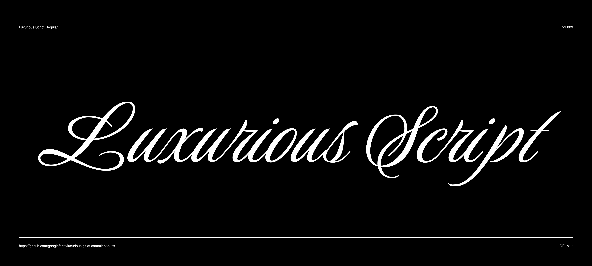

# Luxurious Script

Luxurious — the perfect description for this stunning formal script. It has cursive forms, with highly slanted and condensed characters, giving continuity to the over all feel of bodies of text.

The added flourishing available enhances the beauty of the forms, making display images exude the richness of royalty.



## Building the Fonts

The font is built using fontmake and gftools post processing script. Tools are all python based, so it must be previously installed.

To install all the Python tools into a virtualenv, do the following:

From terminal:

```

cd your/local/project/directory

#once in the project folder create a virtual environment. 
This step has to be done just once, the first time:

python3 -m venv venv

#activate the virtual environment

source venv/bin/activate

#install the required dependencies

pip install -r requirements.txt

```

Then run the this command:

```
cd sources
gftools builder config.yml
```
